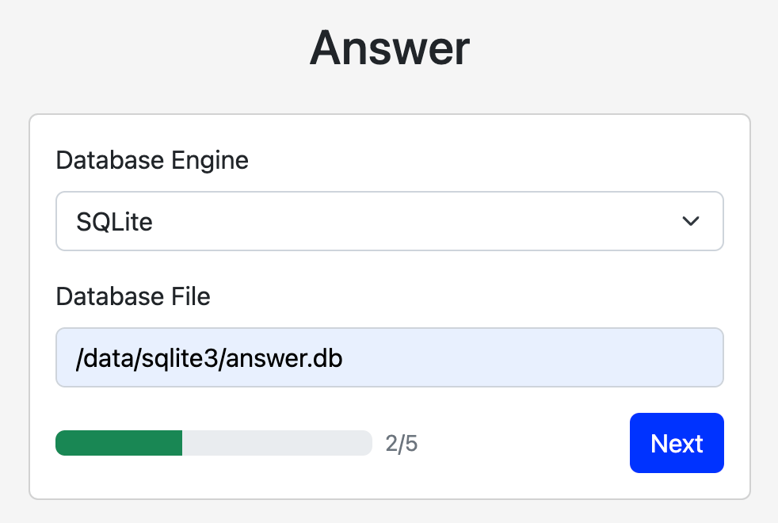
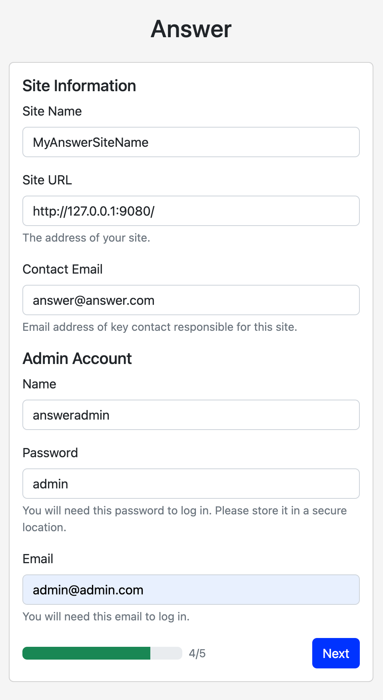

# Answer 安装指引

## 使用 docker 安装
### 步骤 1: 使用 docker 命令启动项目
```bash
docker run -d -p 9080:80 -v answer-data:/data --name answer answerdev/answer:latest
```
### 步骤 2: 访问安装路径进行项目安装
[http://127.0.0.1:9080/install](http://127.0.0.1:9080/install)

选择语言后点击下一步选择合适的数据库，如果当前只是想体验，建议直接选择 sqlite 作为数据库，如下图所示



然后点击下一步会进行配置文件创建等操作，点击下一步输入网站基本信息和管理员信息，如下图所示



点击下一步即可安装完成

### 步骤 3：安装完成后访问项目路径开始使用
[http://127.0.0.1:9080/](http://127.0.0.1:9080/)

使用刚才创建的管理员用户名密码即可登录。

## 使用 docker-compose 安装
### 步骤 1: 使用 docker-compose 命令启动项目
```bash
mkdir answer && cd answer
wget https://raw.githubusercontent.com/answerdev/answer/main/docker-compose.yaml
docker-compose up
```

### 步骤 2: 访问安装路径进行项目安装
[http://127.0.0.1:9080/install](http://127.0.0.1:9080/install)

具体配置与 docker 使用时相同

### 步骤 3：安装完成后访问项目路径开始使用
[http://127.0.0.1:9080/](http://127.0.0.1:9080/)

## 使用 二进制 安装
### 步骤 1: 下载二进制文件
[https://github.com/answerdev/answer/releases](https://github.com/answerdev/answer/releases)
请下载您当下系统所需要的对应版本

### 步骤 2: 使用命令行安装
> 以下命令中 -C 指定的是 answer 所需的数据目录，您可以根据实际需要进行修改

```bash
./answer init -C ./answer-data/
```

然后访问：[http://127.0.0.1:9080/install](http://127.0.0.1:9080/install) 进行安装，具体配置与使用 docker 安装相同

### 步骤 3: 使用命令行启动
安装完成之后程序会退出，请使用命令正式启动项目
```bash
./answer run -C ./answer-data/
```

正常启动后可以访问 [http://127.0.0.1:9080/](http://127.0.0.1:9080/) 使用安装时指定的管理员用户名密码进行登录

## 安装常见问题
- 使用 docker 重新安装遇到问题？默认我们给出的命令是使用 `answer-data` 命名卷，所以如果重新不需要原来的数据，请主动进行删除 `docker volume rm answer-data`
