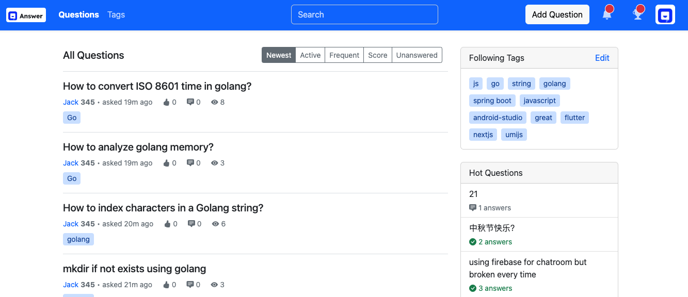

# Answer - Simple Q&A Community

[](https://github.com/segmentfault/answer/blob/master/LICENSE)
[](https://golang.org/)
[](https://reactjs.org/)

## What is Answer?
This is a minimalist open source Q&A community. Users can post questions and others can answer them.


## Why?
- Help organizations build knowledge and Q&A communities better and faster.

## Features
- Produce knowledge by asking and answering questions.
- Maintain knowledge by voting and working together.

## Quick start
### Running with docker-compose
```bash
mkdir answer && cd answer
wget https://github.com/segmentfault/answer/releases/latest/download/docker-compose.yaml
docker-compose up
```

For more information you can see [INSTALL.md](./INSTALL.md)

## Contributing

Contributions are always welcome!

See [CONTRIBUTING.md](CONTRIBUTING.md) for ways to get started.

## License

[MIT](https://github.com/segmentfault/answer/blob/master/LICENSE)
